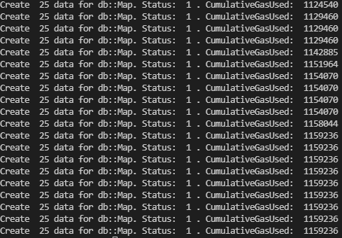
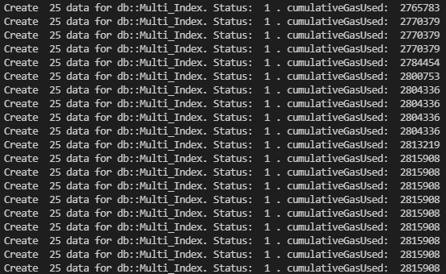
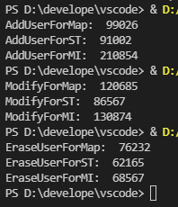

# Tutorials and Evaluation

前期发布过wasm合约内置数据结构的使用教程，详见《[PlatON WASM contract (八) - 内置数据结构](https://devdocs.platon.network/docs/zh-CN/WASM_Contract_8)》。我们正在参加的黑客松活动刚好对链上数据存储及访问有一定性能上的需求，本教程将针对性能方面做一个简单的测评。

## 合约源码

### WasmDataStruct.h

### WasmDataStruct.cpp

### 合约代码说明：

* 在《[PlatON WASM contract (八) - 内置数据结构](https://devdocs.platon.network/docs/zh-CN/WASM_Contract_8)》的基础之上，增加了性能测试的接口；
* 同时为了避免外部调用误操作，《[PlatON WASM contract (八) - 内置数据结构](https://devdocs.platon.network/docs/zh-CN/WASM_Contract_8)》中的基础接口将不再“导出”（即从外部将不可调用）；
* CreateData将用于设置测试规模（增量）；
* 该合约的设计主要针对性能测试，实际开发中，需要注意 `db::Map` 的使用问题（它没有使用迭代器遍历访问的接口，在使用中如果要遍历，可能需要将 `key` 通过其他途径存下来，这一点从使用上说其实是不太方便的，这主要与持久化存储有关，特点是单项数据的查询、修改很快）； 
* 主要针对三种内置数据容器中数据的单项添加、修改、删除操作进行性能测试；
* 值得一提的是，在BatchClear的实现中，对于`db::MultiIndex` ，直观上看，删除操作直接利用迭代器来遍历（代码中注释掉的部分），在每个loop中会少一次查找的开销。但是，通过测试，发现实际上当数据量较多时，迭代器遍历的的开销非常的巨大，有限gas内即使清理一条数据都无法实现，反而是目前代码中的实现方式，gas消耗可以接收（BatchClear可以分多次调用来清理数据）。这与链上持久化存储合约数据的机制有关， `db::Map` 推测有相同的情况，这也是`db::Map` 没有提供迭代器操作的原因。
## 测试用例

### 代码

#### DataStructPerformace.py

#### 说明

* create相关操作，分别针对 `db:Map` 、  `StorageType` 、 `db::MultiIndex` 增量的写入数据，每种类型总共插入500条数据，分20轮次，每轮次25条；
* add、modify、erase为单项数据的相关操作；
* clear批量的清理链上数据。
### 测试场景

* 增量测试
    * 分别调用 `CreateDataForMap` 、 `CreateDataForMI` 、 `CreateDataForST` ，向`db:Map` 、  `StorageType` 、 `db::MultiIndex` 中分轮次批量添加500条数据，三种类型分别测试，不受其他数据影响；
    * `db:Map`的gas消耗如下：

    * `db::MultiIndex`的gas消耗如下：

    * `StorageType`的gas消耗如下：

可以看到，实际上最后5次添加数据已经失败了。

    * 通过对三种类型的gas消耗对比分析，可以看出，对于`db:Map` 和`db::MultiIndex` ，虽然数据量持续增长，但每个轮次gas消耗基本稳定；对于`StorageType` 则随着数据的增长gas消耗持续增长。

* clear后，依次调用`CreateDataForMap` 、 `CreateDataForMI` 、 `CreateDataForST` ，分别添加500条数据，共计1500条数据，此时进行单项测试
    * 调用 `Add` 、`Modify` 、`Erase` ，执行添加单项数据操作，结果如下：

    * 从针对三种数据结构的单项数据操作看，再已经填充了数据的情况下（几百条的量级，应该说数据量并不大），三者都消耗了865万左右的gas。
    * 咋看起来三种数据结构几乎性能一致，但是，回顾前文提到的增量测试的情况，对于三种数据结构，每个loop中都插入了25条数据，在 `db::Map` 、`db::MultiIndex`数据结构中，尽管数据量递增，但每个轮次消耗的gas几乎稳定，且相对低很多（约160万和280万）。而在单项测试时，即使Add一条数据，gas消耗都达到了非常高的程度，这应该是不太合理的。
    * 而单项测试中的调用，针对`db::Map` 、`db::MultiIndex` 的情况，与前文对比，从合约状态上看主要是多了 `StorageType` 数据类型的批量数据，所以推测是它对合约性能造成了影响。
下面我们专门针对这一点，进行一些测试来证明我们的推测。

* `StorageType` 对性能的影响
    * 重新部署合约，向`db::Map` 、`db::MultiIndex` 分别添加750条数据，总计1500条，数据总量与前文中的测试数据总量相等，gas消耗的曲线分别为：

    * 分别调用`Add` 、`Modify` 、`Erase` ，结果如下：

    * 可以看出，数据线性增长时，`db::Map` 、`db::MultiIndex` 消耗的gas几乎稳定。同时单项操作的gas消耗非常少；
    * 接下来我们向StorageType中添加200条数据：

    * 再次分别调用`Add` 、`Modify` 、`Erase` ，结果如下：

    * 与前文中推测一致，使用`StorageType` 在链上持久化存储数据，不仅自身消耗很大，同时会影响合约其他类型数据访问的消耗。
## 总结

由 此可见，storagetype虽然使用上灵活性较高，但由于其在底层实现上每一次都需要将全部数据读取出来进行操作，所以性能最低。同时，还类型的数据规模太大，还会提高合约中其他持久化数据操作的开销（原因和合约以及虚拟机数据的整个持久化机制有关）。因此，如非必要，应尽量减少对storagetype类型的使用。目前，在Breaking News中也正在针对这方面进行优化。